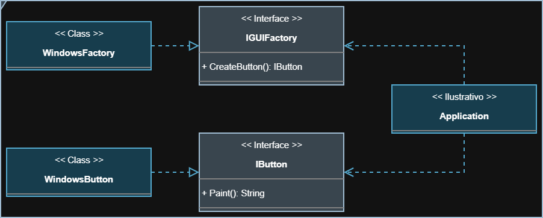

<section align="center">
   <h1>Visão Geral</h1>
</section>

<section>
   

      O padrão <strong>Abstract Factory</strong> define interfaces abstratas
      para objetos e fábricas, isolando a criação do uso. É útil quando um
      sistema precisa ser independente da forma como as estruturas são
      implementadas. Além disso, garante consistência entre instâncias da mesma
      família.
   

</section>

<section align="center">
   <h2>Diagrama da Implementação</h2>
   
</section>
