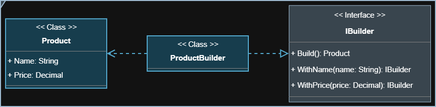

<section align="center">
   <h1>Visão Geral</h1>
</section>

<section>
   

      O padrão <strong>Builder</strong> separa a construção de uma instância da
      sua representação, facilitando a criação de objetos complexos passo a
      passo. Também permite gerar diferentes variações de um mesmo tipo,
      melhorando a legibilidade do código ao isolar cada etapa do processo de
      construção.
   

</section>

<section align="center">
   <h2>Diagrama da Implementação</h2>
   
</section>
