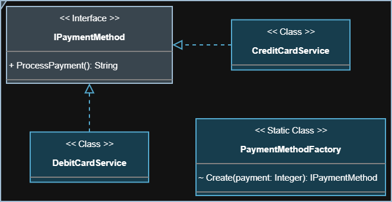

<section align="center">
   <h1>Visão Geral</h1>
</section>

<section>
   

      O padrão <strong>Factory Method</strong> define uma interface para criar
      objetos, mas deixa que as subclasses decidam qual classe concreta
      instanciar. Ele permite que a criação seja feita de forma flexível, sem
      acoplar o código. Além disso, facilita a extensão do sistema, permitindo
      introduzir novas classes concretas sem modificar o código existente.
   

</section>

<section align="center">
   <h2>Diagrama da Implementação</h2>
   
</section>
